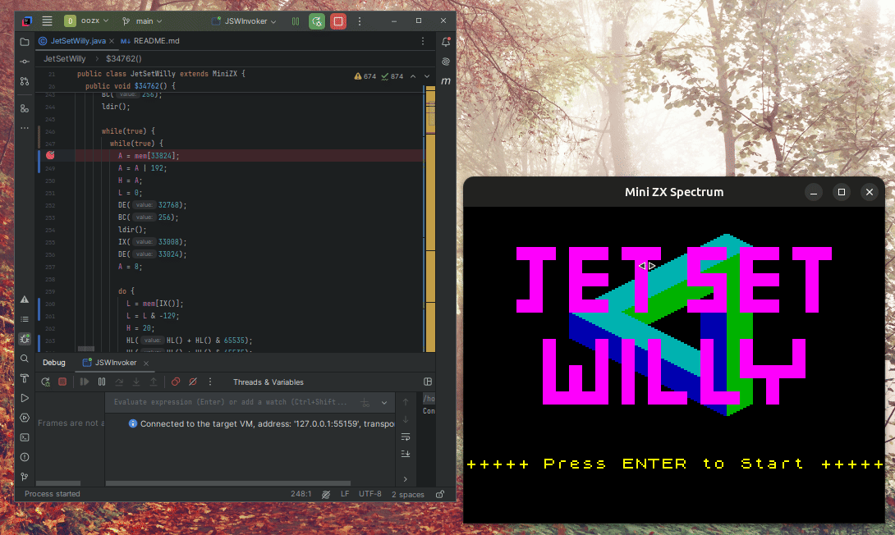

[](https://github.com/fpetrola/oozx/actions/workflows/maven.yml)


# OOZX: Object-Oriented Z80 Emulator for ZX Spectrum to Java Translation

OOZX is an open-source project that provides a Z80 emulator with a unique object-oriented approach. This emulator can automatically translate ZX Spectrum games into pure Java code, leveraging the power and flexibility of Object-Oriented Programming (OOP).



## Key Features

- **Automatic Translation**: Converts ZX Spectrum games into Java code, providing a way to enjoy these classic games within a modern, portable environment.
- **Object-Oriented Design**: Uses OOP principles to organize and manage code, making the emulator modular and easy to maintain.
- **Advanced Z80 Instruction Handling**:
    - **Instruction Visitor Pattern**: Allows instructions to be processed at different levels, simplifying emulation and translation.
    - **Instruction Factory**: Provides a centralized way to create instructions, supporting consistency and extensibility.
    - **Prototype Pattern**: Enables efficient management and reuse of instructions.
    - **Virtual Registers**: Abstracts Z80 registers, allowing for a cleaner and more adaptable implementation.
    - **Generic Data Types for Instructions**: Facilitates flexible handling of different instruction types.
    - **Instruction Hierarchy**: Organizes instructions in a hierarchical manner for better code structure and readability.
    - **Z80 Opcode Decoding**: Leverages Cristian Dinu’s decoding approach, based on his excellent documentation at [z80.info](http://www.z80.info/decoding.htm).

## How It Works

The core of **oozx** is an object-oriented Z80 emulator with each instruction modeled, categorized, and accessible via a visitor pattern. Registers support various data types, enabling advanced dataflow analysis, such as value tainting. The `InstructionVisitor` facilitates tasks like instruction cloning, register replacement, data scope verification, and bytecode translation.

To cover all code paths without playing through each level, oozx uses symbolic execution to analyze all possible flows. A basic self-modifying code (SMC) detection algorithm monitors instructions writing to non-static data regions, adapting mutant data into memory access, with future enhancements planned for more complex SMC scenarios.

### Screen Visualization

For visualizing the ZX Spectrum screen memory, oozx includes a simple screen component built with Java Swing. Using `Graphics2D`, this component provides a straightforward yet effective view of the screen memory, helping developers visualize the game's display.

### Bytecode Generation

For generating bytecode, oozx uses the [Maker](https://github.com/cojen/Maker) library, which simplifies the creation of variables, methods, fields, and bytecode on the fly, or for saving as `.class` files. To generate Java source code, oozx leverages the [Fernflower decompiler](https://github.com/windup/windup/tree/master/impl/thirdparty/fernflower), which supports converting bytecode back into readable Java code.

---

### Get Involved

If you’re interested in contributing to oozx, there are many exciting areas for development. Some potential enhancements include:
- Improving the conversion of fields to variables
- Detecting and interpreting sprites, sound data, character coordinates, lives, time variables, and more
- Exploring advanced features, such as inferring classes, objects, and methods from the original game code

I hope this overview gives you a clear picture of how oozx works! If you're excited about joining the development, feel free to reach out—there’s a lot to explore to make more games fully compatible and improve the quality of translation.


## Getting Started

### Prerequisites
- **Java 21 or higher** (required for running the translated Java code)

### Installation
1. Clone this repository:
   ```bash
   git clone https://github.com/fpetrola/oozx.git

### Games Translation

#### Usage

   ```bash
   java -jar bytecodeGenerator/target/bytecodeGenerator-0.0.1-SNAPSHOT.jar [execute/translate] [game-name] [url] [main-routine-address]
   ```
  Using "translate" will be creating "game-name.java" source code instead of creating bytecode on the fly.
#### Examples

   ```bash
   mvn clean install
   java -jar bytecodeGenerator/target/bytecodeGenerator-0.0.1-SNAPSHOT.jar execute jetsetwilly http://torinak.com/qaop/bin/jetsetwilly 34762
   java -jar bytecodeGenerator/target/bytecodeGenerator-0.0.1-SNAPSHOT.jar execute manicminer http://torinak.com/qaop/bin/manicminer 33792
   ```
#### Translation status
* Jet Set Willy 100%
* Manic Miner 80%
