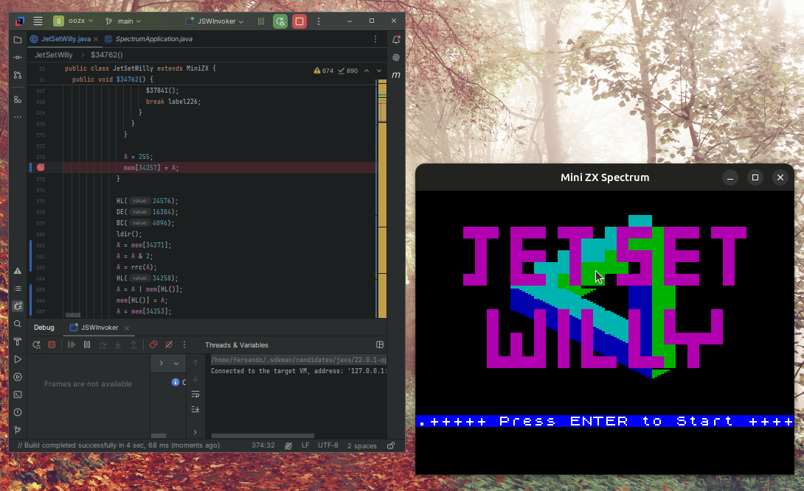

# OOZX: Object-Oriented Z80 Emulator for ZX Spectrum to Java Translation

OOZX is an open-source project that provides a Z80 emulator with a unique object-oriented approach. This emulator can automatically translate ZX Spectrum games into pure Java code, leveraging the power and flexibility of Object-Oriented Programming (OOP).



## Key Features

- **Automatic Translation**: Converts ZX Spectrum games into Java code, providing a way to enjoy these classic games within a modern, portable environment.
- **Object-Oriented Design**: Uses OOP principles to organize and manage code, making the emulator modular and easy to maintain.
- **Advanced Z80 Instruction Handling**:
    - **Instruction Visitor Pattern**: Allows instructions to be processed at different levels, simplifying emulation and translation.
    - **Instruction Factory**: Provides a centralized way to create instructions, supporting consistency and extensibility.
    - **Prototype Pattern**: Enables efficient management and reuse of instructions.
    - **Virtual Registers**: Abstracts Z80 registers, allowing for a cleaner and more adaptable implementation.
    - **Generic Data Types for Instructions**: Facilitates flexible handling of different instruction types.
    - **Instruction Hierarchy**: Organizes instructions in a hierarchical manner for better code structure and readability.
    - **Z80 Opcode Decoding**: Leverages Cristian Dinu’s decoding approach, based on his excellent documentation at [z80.info](http://www.z80.info/decoding.htm).

## Getting Started

### Prerequisites
- **Java 21 or higher** (required for running the translated Java code)

### Installation
1. Clone this repository:
   ```bash
   git clone https://github.com/fpetrola/oozx.git

### Games Translation

#### Usage

   ```bash
   java -jar translator/target/translator-0.0.1-SNAPSHOT.jar [execute/translate] [game-name] [url] [main-routine-address]
   ```
  Using "translate" will be creating "game-name.java" source code instead of creating bytecode on the fly.
#### Examples

   ```bash
   mvn clean install
   java -jar translator/target/translator-0.0.1-SNAPSHOT.jar execute jetsetwilly http://torinak.com/qaop/bin/jetsetwilly 34762
   java -jar translator/target/translator-0.0.1-SNAPSHOT.jar execute manicminer http://torinak.com/qaop/bin/manicminer 33792
   ```
#### Translation status
* Jet Set Willy 100%
* Manic Miner 80%