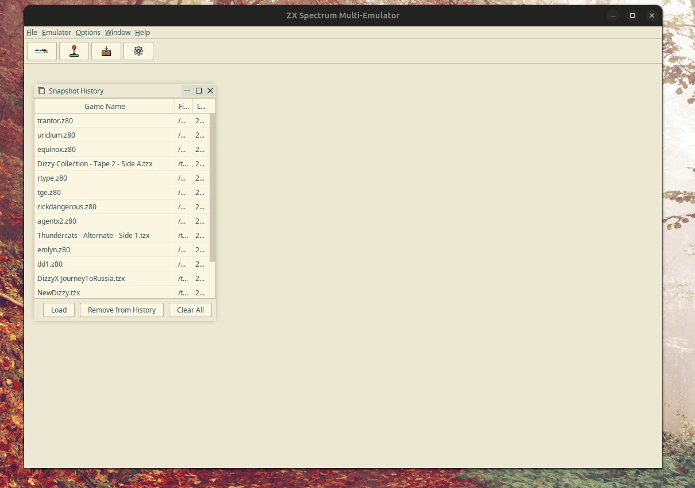
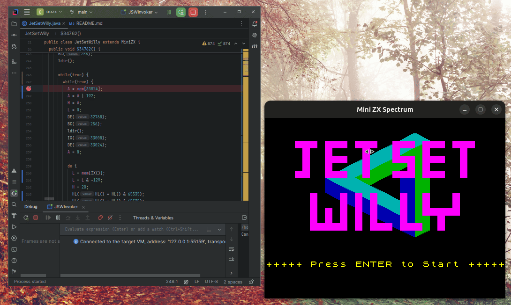

# OOZX: Object-Oriented Z80 Emulator for Translating ZX Spectrum Games to Java

[](https://github.com/fpetrola/oozx/actions/workflows/maven.yml)

OOZX is a comprehensive, open-source Z80 emulator and ZX Spectrum game emulation platform built with clean object-oriented architecture. It provides both powerful bytecode translation capabilities for converting classic ZX Spectrum games into modern Java applications, and a feature-rich desktop environment for playing and exploring these retro games.



---

## Table of Contents

- [Overview](#overview)
- [Core Features](#core-features)
  - [Game Translation Engine](#game-translation-engine)
  - [Emulation Engine](#emulation-engine)
  - [Desktop Environment](#desktop-environment)
  - [Advanced Capabilities](#advanced-capabilities)
- [Desktop Application Features](#desktop-application-features)
- [Technical Architecture](#technical-architecture)
- [Installation & Usage](#installation--usage)
- [Project Status](#project-status)
- [Development](#development)

---

## Overview

OOZX represents a unique intersection of retro computing and modern software engineering. It delivers:

1. **A Complete ZX Spectrum Emulator** with high precision hardware emulation for authentic gaming experience
2. **A Game Translation Framework** that converts original Z80 machine code into optimized Java bytecode
3. **An Integrated Desktop Environment** providing game browsing, library management, and advanced emulation controls
4. **Object-Oriented Architecture** emphasizing maintainability, extensibility, and clean design patterns

Whether you want to play classic ZX Spectrum games, translate them to modern platforms, or study the architecture of retro systems, OOZX provides comprehensive tools for all these goals.

---

## Core Features

### Game Translation Engine

The bytecode translation system transforms ZX Spectrum Z80 assembly into Java:

- **Automatic Translation**: Converts Z80 binaries directly into executable Java bytecode
- **Symbolic Execution**: Analyzes all code paths without requiring gameplay, discovering edge cases and implicit behavior patterns
- **Comprehensive Path Analysis**: Navigates conditional branches and jumps to ensure complete code coverage
- **Self-Modifying Code (SMC) Detection**: Identifies and handles dynamic code generation patterns common in retro games
- **Multiple Output Formats**: 
  - Direct bytecode execution for immediate results
  - Java source code generation for code inspection and modification
  - Bytecode serialization for standalone JVM execution

**Translation Status**:
- **Jet Set Willy**: Fully translated (100%)
- **Manic Miner**: Fully translated (100%)
- **Dynamite Dan**: Partially translated (~95%)
- **Everyone's a Wally**: Partially translated (~90%)

  


### Emulation Engine

High-precision Z80 CPU emulation with sophisticated memory and I/O modeling:

#### CPU Emulation
- **Complete Z80 Instruction Set**: Full implementation of all Z80 opcodes using Cristian Dinu's comprehensive decoding methodology ([z80.info](http://www.z80.info/decoding.htm))
- **Object-Oriented Instruction Model**: Each instruction is a first-class object enabling:
  - **Visitor Pattern**: Traverse instructions for analysis, transformation, and cloning
  - **Instruction Factory**: Centralized instantiation ensuring consistency and type safety
  - **Prototype Pattern**: Efficient reuse and management of instruction objects
  - **Generic Type Support**: Flexible handling of diverse instruction semantics

#### Memory System
- **48KB/128KB Memory Configuration**: Full support for both Spectrum models
- **Paging System**: Proper handling of memory banks and page switching
- **Memory Contention**: Accurate cycle-by-cycle memory access timing
- **Screen Memory Protection**: Correct rendering of ULA screen memory without interference

#### I/O & Peripherals
- **ULA Chip Emulation**: Complete sound synthesis and screen rendering
- **Tape Interface**: Loading simulation with multiple tape speed settings
- **Disk Interface Support**: Beta support for +3 disk drive emulation
- **Joystick Support**: Multiple joystick types including Kempston, Fuller Box, and others
- **Printer Interface**: ZX Printer emulation
- **Sound Output**: 
  - Beeper sound synthesis with authentic spectrum
  - AY-3-8912 audio chip emulation with stereo separation control
  - Multiple sound quality levels

#### Precision & Accuracy
- **Cycle-Accurate Timing**: Frame-perfect emulation with proper timing of all subsystems
- **Video Rendering**: Authentic ULA behavior with correct color attributes and pixel timing
- **Scanline Effects**: Optional scanline rendering for authentic visual appearance
- **Snow Effect**: Optional recreation of video snow effect common in older monitors

### Desktop Environment

A fully-featured Swing-based desktop application providing an integrated gaming and exploration platform:

#### Multi-Window Management
- **MDI (Multiple Document Interface)**: Run multiple emulator instances simultaneously
- **Window Management**: Cascade, tile, and arrange multiple emulator windows
- **Persistent Layout**: Preserve window positions and states across sessions

#### Game Browser & Library
- **Integrated Game Search**: Real-time game search with instant results
- **ZXInfo API Integration**: Direct connection to the comprehensive ZXInfo.dk game database
- **Rich Game Metadata**: 
  - Game cover artwork
  - Screenshots and galleries
  - Publisher and author information
  - Release dates and version history
  - Genre classification and rating systems
  - Compatibility information across Spectrum models
- **Game Details Dialog**: Multi-tabbed display with:
  - General information and descriptions
  - Technical specifications and machine compatibility
  - Complete release history across platforms
  - Author and publisher listings
  - Screenshot gallery with zoom capability
  - Additional download links and resources

#### Emulation Controls & Features
- **Flexible Model Selection**: Switch between ZX Spectrum 48K, 128K, +2, +3 with runtime configuration
- **Turbo Mode**: Speed up execution for faster gameplay or testing
- **Pause/Resume**: Full control over game execution state
- **Sound Control**: Mute/unmute with independent beeper and AY volume controls
- **Graphics Options**:
  - Display filters (scanlines, TV effect, motion blur)
  - Brightness and contrast adjustment
  - Aspect ratio correction (strict 4:3 or pixel perfect)
  - Multiple scaling algorithms

#### Snapshot Management
- **Snapshot Save/Load**: Preserve game state at any moment
- **Snapshot History**: Browse and manage previously saved snapshots
- **Quick Access**: Double-click to instantly restore a saved state
- **File Browser Integration**: Standard file chooser for snapshot management

#### Game Enhancement System
- **Pokes/Cheats System**: Apply memory modifications to alter gameplay:
  - Pre-configured cheat codes for popular games
  - Custom poke entry with hexadecimal address and value specification
  - Visual indicator of applied modifications
  - Persistent cheat database

#### Settings & Configuration
Comprehensive settings dialog with organized tabbed interface:

**Video Settings**:
- ULA type and display mode
- Border and display filter options
- Brightness, contrast, and snow effect controls
- Aspect ratio and scaling preferences
- Custom resolution support

**Audio Settings**:
- Master volume and component-specific levels (beeper, AY)
- AY chip emulation quality
- Stereo separation control
- Sample rate configuration
- Beeper quality modes

**Input Settings**:
- Multiple keyboard layouts (Spectrum, European, American, etc.)
- Joystick type configuration
- Keyboard issue selection (2/3)
- Mouse emulation support
- Joystick prompt on startup

**Storage Settings**:
- Tape loading speed control
- Disk interface selection
- Auto-load and fast-load toggles
- Microdrive support
- Write protection for disk images

**Machine Settings**:
- CPU model selection (48K, 128K, +2, +3)
- Custom ROM loading
- Late timing adjustments
- Memory contention simulation
- High-resolution color mode (for +3)

**Peripheral Settings**:
- ZX Interface 1/2 support
- Printer interface options
- Extended input devices (Kempston mouse, Fuller Box)
- Sound card support (Melodik AY, SpecDrum)

**General Settings**:
- Default turbo mode state
- Frame rate limiting
- Confirmation dialogs
- Snapshot embedding in files

#### Theme Support
- **Multiple UI Themes**: Darcula, OneDark, Solarized Light/Dark, and IntelliJ
- **Dark/Light Mode**: Automatic or manual theme switching
- **Modern Look and Feel**: DarkLaf-based UI for contemporary appearance

#### Menu System
- **File Menu**: Create snapshots, load/save states, access recent games, quit application
- **Emulator Menu**: Create new emulator instances, access game browser, manage emulation state
- **Options Menu**: Global settings configuration
- **Window Menu**: Manage multiple emulator windows, switch themes
- **Help Menu**: View documentation and application information

#### Extended Features
- **README Viewer**: Built-in HTML-rendered documentation viewer
- **About Dialog**: Application information, version details, and links to repository
- **Download Viewer**: Monitor and manage file downloads from game sources
- **Game Not Found Dialog**: Fallback search interface when specific game unavailable

---

## Technical Architecture

### Object-Oriented Design

OOZX demonstrates professional software engineering practices:

#### Design Patterns
- **Visitor Pattern**: Instruction traversal and analysis infrastructure
- **Factory Pattern**: Centralized instruction object creation
- **Prototype Pattern**: Efficient instruction object management
- **Observer Pattern**: Event-driven emulator state changes
- **Strategy Pattern**: Pluggable rendering and audio backends
- **MVC Architecture**: Separation of emulation engine from presentation layer

#### Modularity & Separation of Concerns
The project is organized into focused modules:

- **`emulator`**: Core Z80 CPU emulation engine with memory management
- **`virtual`**: Virtual register abstractions and dataflow analysis
- **`machine`**: Desktop application UI and integration layer
- **`translator`**: Game-to-Java bytecode translation system
- **`bytecode`**: Dynamic bytecode generation and execution
- **`integration`**: Snapshot save/load and system integration
- **`blocks`**: Instruction block analysis for translation
- **`routines`**: Game-specific routine detection and analysis
- **`se`**: Symbolic execution engine for path analysis

#### Code Quality
- **Type Safety**: Leverages Java's strong typing for compile-time error detection
- **Generic Types**: Flexible data type handling without sacrificing safety
- **Clear Abstraction Boundaries**: Each module has well-defined responsibilities
- **Testability**: Comprehensive test suite using JUnit 5
- **Documentation**: Inline code documentation and architecture guides

### Extensibility

The architecture supports easy extension:

- **Custom Instruction Handlers**: Implement new instruction types without modifying core
- **Pluggable I/O Devices**: Add new peripherals by implementing interface contracts
- **Configurable Rendering**: Support for additional video output formats
- **Scalable Memory Models**: Accommodate various Spectrum configurations and expansions

### Performance Optimization

- **Efficient Memory Access**: Direct array-based memory implementation
- **Instruction Caching**: Reuse decoded instruction objects
- **Symbolic Execution Optimization**: Reduced redundant path exploration
- **Bytecode Generation**: Direct JVM compilation for zero-interpretation overhead
- **FastUtil Integration**: High-performance collections for large datasets

---

## Installation & Usage

### Prerequisites
- **Java 18 or later**
- Maven 3.6+

### Installation

1. **Clone the repository**:
   ```bash
   git clone https://github.com/fpetrola/oozx.git
   cd oozx
   ```

2. **Build the project**:
   ```bash
   mvn clean install
   ```

### Running the Desktop Application

Launch the integrated emulator and game browser:
```bash
mvn exec:java -pl machine -Dexec.mainClass="com.fpetrola.oozx.fuse.OOSpectrumLauncher"
```

Or build and run the JAR:
```bash
cd machine
mvn package
java -jar target/machine-0.0.1-SNAPSHOT.jar
```

### Game Translation

Use the bytecode translation engine to convert games:

```bash
java -jar bytecode/target/bytecodeGenerator-0.0.1-SNAPSHOT.jar [command] [game-name] [url] [address]
```

**Commands**:
- `execute`: Generate and run bytecode directly in the JVM
- `translate`: Produce `game-name.java` source code for inspection

**Examples**:
```bash
# Execute Jet Set Willy
java -jar bytecodeGenerator-0.0.1-SNAPSHOT.jar execute jetsetwilly http://torinak.com/qaop/bin/jetsetwilly 34762

# Translate Manic Miner to Java source
java -jar bytecodeGenerator-0.0.1-SNAPSHOT.jar translate manicminer http://torinak.com/qaop/bin/manicminer 33792
```

### Desktop Application Features

Once running, the desktop application provides:

1. **Create New Emulator**: Click the toolbar button to launch a new emulator window
2. **Browse Games**: Access the integrated game browser to search and browse ZXInfo database
3. **View Game Details**: Select any game to view comprehensive information and metadata
4. **Play Games**: Click "Play" to launch directly in the emulator with configured settings
5. **Manage Snapshots**: Save game states and access snapshot history for quick restoration
6. **Configure Settings**: Open preferences to customize emulation, audio, video, and input settings
7. **Apply Cheats**: Use the pokes/cheats system to modify game behavior

---

## Project Status

### Full Emulation Support
- ✅ 48K Spectrum (full compatibility)
- ✅ 128K Spectrum (full compatibility)
- ✅ +2/+3 Spectrum (+3 disk support in beta)
- ✅ All major peripherals and I/O devices
- ✅ Complete Z80 instruction set

### Game Translation Status
- ✅ Jet Set Willy: 100% translation complete
- ✅ Manic Miner: 100% translation complete
- ⚠️ Dynamite Dan: ~95% translation (complex sprite handling)
- ⚠️ Everyone's a Wally: ~90% translation (advanced memory tricks)

### Known Limitations
- Some advanced SMC patterns require manual analysis
- A few edge-case Z80 instructions have partial implementation
- Disk interface emulation is in beta (works for basic +3 games)

---

## Development

### Architecture Documentation

For detailed information about the project architecture, design decisions, and implementation details, see:
- `ARCHITECTURE_GAME_DETAILS.md` - Deep dive into game architecture and internals
- `GAME_DETAILS_ENHANCEMENT.md` - Game metadata system and ZXInfo integration
- `USAGE_GAME_DETAILS.md` - Practical usage guide and workflows
- `TESTING_GAME_DETAILS.md` - Testing strategies and verification approaches

### Contributing

OOZX provides excellent opportunities for enhancement:

**Translation Improvements**:
- Improved variable translation from fields to local representations
- Advanced data pattern recognition (sprites, sound data, score tables)
- Automatic game structure inference and high-level abstraction extraction

**Emulation Enhancements**:
- Additional peripheral support
- Improved SMC detection and handling
- Performance optimizations for real-time emulation

**UI/UX Features**:
- Advanced game search filters
- Game completion tracking
- Performance benchmarking tools
- Cheat/poke database expansion

**Cross-Platform Support**:
- Native compilations using GraalVM
- Mobile platform adaptation
- Web-based emulation interface

Contributions are welcome via pull requests. Please ensure code follows the existing style and includes appropriate tests.

### Build Profiles

**Standard Build**:
```bash
mvn clean install
```

**Native Compilation** (GraalVM required):
```bash
mvn clean install -Pnative
```

### Dependencies

Key technologies used:
- **ByteBuddy**: Dynamic bytecode generation
- **Jackson**: JSON/XML data binding
- **Guice**: Dependency injection
- **FastUtil**: High-performance collections
- **DarkLaf**: Modern UI theming
- **JUnit 5**: Testing framework
- **Jakarta REST Client**: API integration

---

## License

Licensed under the Apache License, Version 2.0. See `LICENSE` file for details.

---

## Acknowledgments

- **Cristian Dinu** for the comprehensive Z80 opcode decoding methodology
- **ZXInfo.dk** for the comprehensive game database and metadata API
- The retro computing community for preserving ZX Spectrum gaming history
- All contributors and testers who helped improve OOZX

---

## Repository

**GitHub**: [github.com/fpetrola/oozx](https://github.com/fpetrola/oozx)

**Issues & Discussions**: Use the GitHub issue tracker for bug reports, feature requests, and discussions.

---

## Contact & Support

For questions, suggestions, or collaboration opportunities, please open an issue on the GitHub repository or contact through the project's discussion forum.

---

**OOZX: Where Retro Computing Meets Modern Software Engineering**
